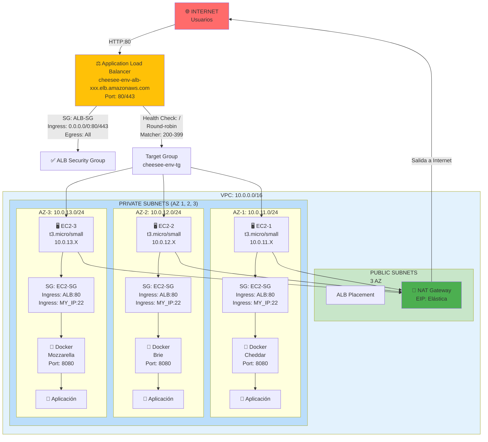
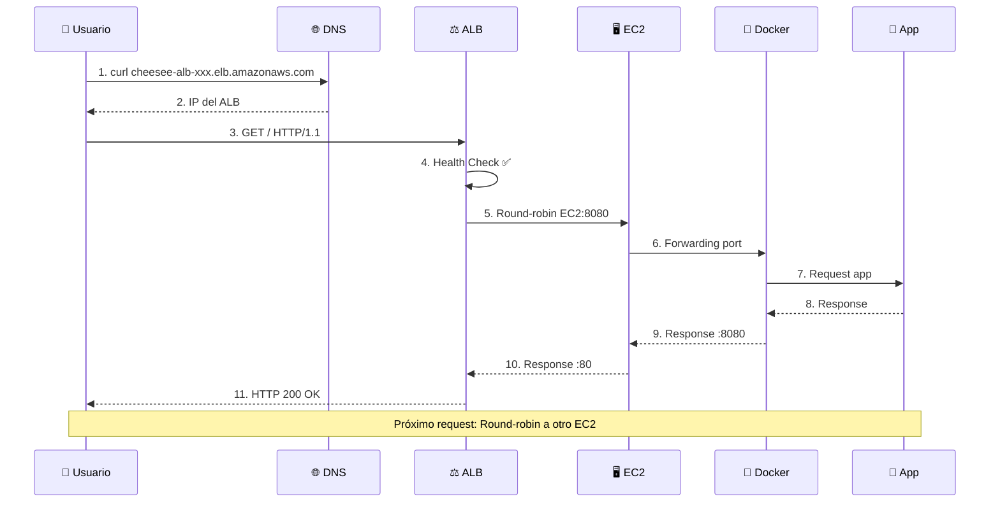
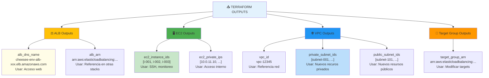
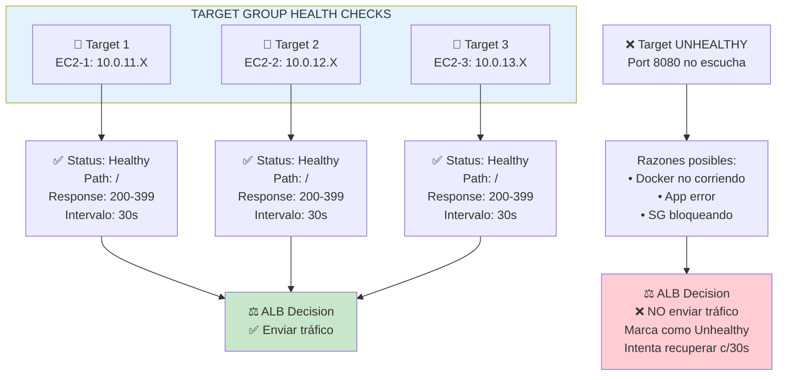
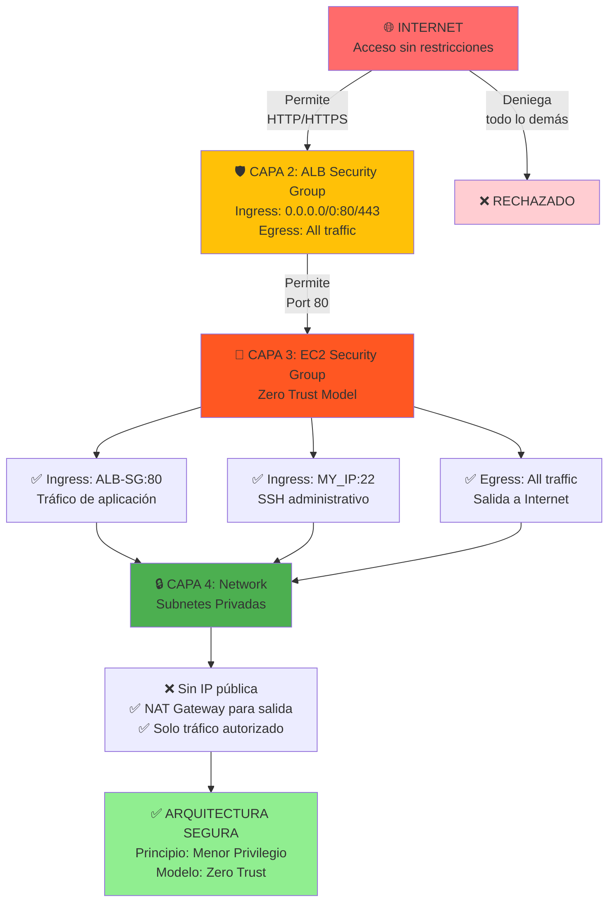

# 🚀 App Infrastructure

Módulo de infraestructura que despliega la plataforma de servicios de "The Cheese Factory" en AWS.

## 🏗️ Arquitectura Completa tras Apply



## 🔄 Flujo de Tráfico HTTP



## ⏺️ Ciclo de Vida de Recursos

```mermaid
flowchart TD
    Start["🚀 terraform apply<br/>infra/app"]
    
    Fase1["FASE 1: Networking<br/>2-3 minutos"]
    Step1_1["✅ VPC 10.0.0.0/16<br/>Creating → Available"]
    Step1_2["✅ Subnetes (6)<br/>Públicas + Privadas"]
    Step1_3["✅ Gateways<br/>IGW + NAT"]
    
    Fase2["FASE 2: Seguridad<br/>1 minuto"]
    Step2_1["✅ ALB-SG<br/>Ingress: 0.0.0.0/0:80/443"]
    Step2_2["✅ EC2-SG<br/>Zero Trust Model"]
    
    Fase3["FASE 3: Balanceo<br/>2-3 minutos"]
    Step3_1["✅ ALB Creada<br/>Provisioning → Active"]
    Step3_2["✅ Target Group<br/>cheesee-env-tg"]
    Step3_3["✅ Listener<br/>ALB:80 → TG"]
    
    Fase4["FASE 4: Cómputo + Docker<br/>4-5 minutos"]
    Step4_1["✅ EC2-1 Lanzada<br/>User Data: Docker pull + run"]
    Step4_2["✅ EC2-2 Lanzada<br/>User Data: Docker pull + run"]
    Step4_3["✅ EC2-3 Lanzada<br/>User Data: Docker pull + run"]
    Step4_4["✅ Targets Registrados<br/>Status: initial → healthy"]
    
    End["✅ INFRAESTRUCTURA OPERATIVA<br/>DNS Accesible<br/>Tráfico Distribuido<br/>Health Checks: PASSING"]
    
    Start --> Fase1
    Fase1 --> Step1_1 --> Step1_2 --> Step1_3
    
    Step1_3 --> Fase2
    Fase2 --> Step2_1 --> Step2_2
    
    Step2_2 --> Fase3
    Fase3 --> Step3_1 --> Step3_2 --> Step3_3
    
    Step3_3 --> Fase4
    Fase4 --> Step4_1 --> Step4_2 --> Step4_3 --> Step4_4
    
    Step4_4 --> End
    
    style Start fill:#90EE90
    style Fase1 fill:#BBDEFB
    style Fase2 fill:#FFE0B2
    style Fase3 fill:#FFC107
    style Fase4 fill:#FF9800
    style End fill:#4CAF50
```



## 📊 Descripción

Este módulo provisiona una infraestructura de aplicación escalable y segura en AWS, incluyendo componentes de red, balanceo de carga y cómputo con integración de contenedores Docker.

## 🏗️ Arquitectura

### Componentes Principales

#### Red (VPC)
- **VPC**: Red privada virtual con segmentación de subredes
- **Subredes Públicas**: Alojan el Application Load Balancer
- **Subredes Privadas**: Alojan instancias EC2 para mayor seguridad

#### Balanceo de Carga
- **Application Load Balancer (ALB)**: Distribuye tráfico HTTP/HTTPS
- **Target Groups**: Configuración de objetivos para equilibrio de carga

#### Seguridad
- **Security Groups**: Implementación de modelo Zero Trust
  - ALB: Acepta tráfico de internet en puertos 80/443
  - EC2: Solo acepta tráfico proveniente del ALB
  - SSH: Restringido a IP administrativa específica

#### Cómputo y Contenedores
- **Instancias EC2**: Servidores con integración Docker
- **User Data Script**: Despliegue automático de contenedores al iniciar instancias
- **Docker Images**: Sabores de queso (imágenes) personalizadas

## 📝 Variables de Configuración

| Variable | Tipo | Descripción | Obligatorio |
|----------|------|-------------|------------|
| `environment` | string | Entorno de despliegue (dev/prod) | Sí |
| `my_public_ip` | string | IP permitida para acceso SSH | Sí |
| `docker_images` | list(string) | Lista de imágenes Docker a desplegar | Sí |
| `aws_region` | string | Región AWS | No |

### Notas sobre Variables

- **environment**: Define el tamaño de instancia EC2 (dev: t2.micro, prod: t2.small)
- **my_public_ip**: Use CIDR notation (ej: 203.0.113.42/32)
- **docker_images**: Sabores de queso disponibles (ej: ["cheddar", "brie", "mozzarella"])

## 🚀 Guía de Despliegue

### Requisitos Previos

- Backend remoto ya configurado (ver [Bootstrap](../bootstrap/README.md))
- Archivo `terraform.tfvars` con valores requeridos
- AWS CLI configurado
- Terraform >= 1.0

### Pasos de Despliegue

#### 1. Preparar Variables

Copia el archivo de ejemplo y actualiza con tus valores:

```bash
cp terraform.tfvars.example terraform.tfvars
# Edita terraform.tfvars con tus valores
```

#### 2. Inicializar Terraform

```bash
terraform init
```

#### 3. Revisar Plan

```bash
terraform plan -var-file="terraform.tfvars"
```

#### 4. Aplicar Configuración

```bash
terraform apply -var-file="terraform.tfvars"
```

#### 5. Obtener Outputs

```bash
terraform output
```

Salida esperada:
```
alb_dns_name = "cheesee-dev-alb-12345.elb.amazonaws.com"
alb_arn = "arn:aws:elasticloadbalancing:..."
ec2_instance_ids = ["i-001", "i-002", "i-003"]
ec2_private_ips = ["10.0.11.10", "10.0.12.10", "10.0.13.10"]
vpc_id = "vpc-12345"
private_subnet_ids = ["subnet-001", "subnet-002", "subnet-003"]
public_subnet_ids = ["subnet-101", "subnet-102", "subnet-103"]
```

### Diagrama: Relación Outputs-Recurso



## 📊 Monitoreo y Verificación

### Verificar Estado de la Aplicación

1. **Acceder a la Consola de AWS**
   - Ve a EC2 → Load Balancers
   - Busca el ALB "cheese-factory-alb"

2. **Verificar Targets Healthy**
   - EC2 → Target Groups → cheese-factory-tg
   - Confirma que el estado de los targets es "Healthy"

3. **Acceder a la Aplicación**
   - DNS del ALB estará disponible en outputs
   - Ejemplo: `http://cheese-factory-alb-xxx.us-east-1.elb.amazonaws.com`

### Diagrama: Estados de Salud



### Logs y Debugging

```bash
# Ver logs de user_data
ssh -i tu_clave ec2-user@<instance-ip>
less /var/log/cloud-init-output.log

# Ver estado de Docker
docker ps -a
docker logs <container-id>
```

## 🔄 Operaciones Comunes

### Escalar Instancias

Edita `terraform.tfvars` y modifica `instance_count`:

```hcl
instance_count = 3
terraform apply -var-file="terraform.tfvars"
```

### Cambiar Imágenes Docker

```bash
terraform apply -var="docker_images=[\"brie\",\"swiss\"]"
```

### Actualizar Security Group

```hcl
# En terraform.tfvars
my_public_ip = "nueva.ip.publica/32"
terraform apply -var-file="terraform.tfvars"
```

## 🗑️ Destruir Infraestructura

```bash
terraform destroy -var-file="terraform.tfvars"
```

## 📚 Archivos Principales

| Archivo | Descripción |
|---------|-------------|
| `main.tf` | Configuración principal de recursos |
| `variables.tf` | Definición de variables de entrada |
| `outputs.tf` | Outputs exportados (ALB DNS, IPs, etc.) |
| `providers.tf` | Configuración de providers y backend |
| `user_data.sh.tpl` | Script de inicialización de instancias |
| `backend.tf` | Configuración del estado remoto |

## ⚠️ Consideraciones Importantes

- El ALB tarda ~2 minutos en alcanzar estado "InService"
- Asegúrate de usar una IP correcta en `my_public_ip` para acceso SSH
- Los costos dependen del entorno seleccionado y cantidad de instancias
- El cifrado de EBS está habilitado por defecto en todas las instancias

## 🔐 Seguridad

- ✅ Security Groups con principio de menor privilegio
- ✅ Acceso SSH restringido a IP específica
- ✅ VPC privada para instancias EC2
- ✅ ALB con permisos restringidos de internet
- ✅ Cifrado de datos en tránsito y en reposo

### Diagrama: Capas de Seguridad (Zero Trust)



---

## 📚 Archivos Principales
