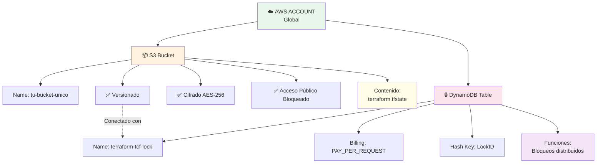
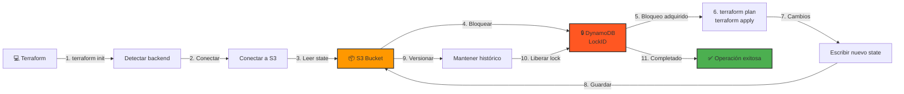
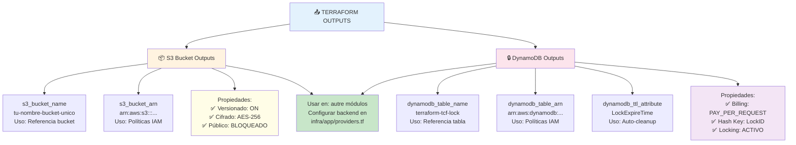
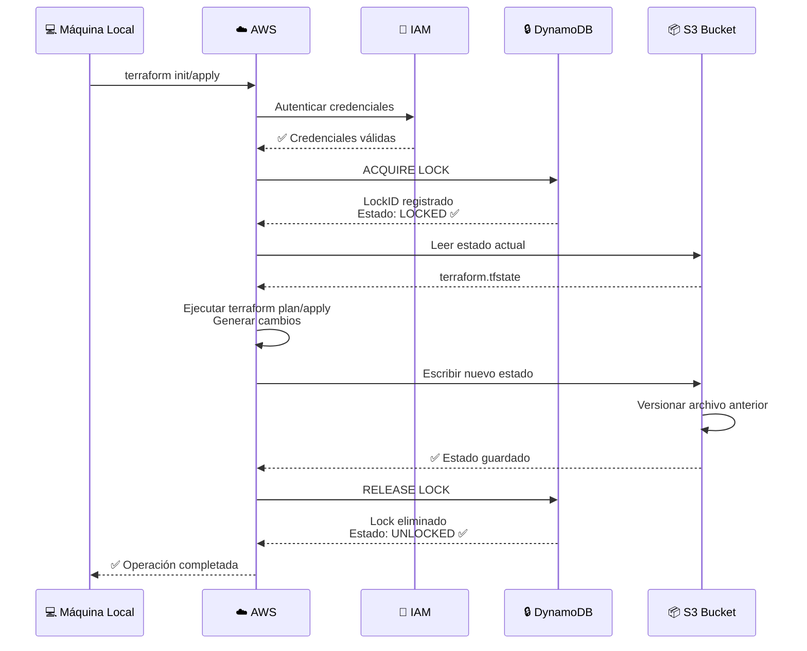
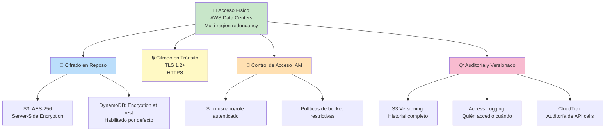

# Backend Bootstrap

Módulo de inicialización que provisiona el estado remoto de Terraform en AWS.

## 🏗️ Arquitectura tras Apply



### Flujo de Funcionamiento

## 📋 Descripción

Este módulo crea la infraestructura necesaria para almacenar y gestionar el estado de Terraform de forma centralizada y segura:

- **Bucket S3**: Almacenamiento centralizado del archivo `terraform.tfstate`
- **Tabla DynamoDB**: Control de bloqueos distribuidos para evitar cambios concurrentes
- **Versionado**: Habilitado en S3 para recuperación de estados anteriores
- **Cifrado**: AES-256 en el bucket S3

## 🔐 Características de Seguridad

- ✅ Bloqueo de acceso público al bucket S3
- ✅ Cifrado del estado de Terraform (AES-256)
- ✅ Versionado habilitado para auditoría
- ✅ Control de bloqueos con DynamoDB
- ✅ Políticas de acceso restrictivas

## 📋 Requisitos Previos

- AWS CLI configurado con credenciales válidas
- Terraform >= 1.0
- Permisos en AWS para crear:
  - Buckets S3
  - Tablas DynamoDB
  - Políticas IAM

## 🚀 Guía de Despliegue

### Paso 1: Preparar Variables

Copia el archivo de ejemplo:

```bash
cp terraform.tfvars.example terraform.tfvars
```

Edita `terraform.tfvars` y configura tu nombre de bucket único:

```hcl
s3_bucket = "mi-nombre-unico-bucket-tcf-2026"
aws_region = "us-east-1"
```

### Paso 2: Inicializar Terraform

```bash
terraform init
```

### Paso 3: Revisar el Plan

```bash
terraform plan -var-file="terraform.tfvars"
```

### Paso 4: Aplicar la Configuración

```bash
terraform apply -var-file="terraform.tfvars"
```

### Paso 5: Verificar Recursos Creados

En AWS Console:
- S3: Confirma que el bucket existe y tiene versionado habilitado
- DynamoDB: Verifica que la tabla `terraform-tcf-lock` existe

## 📝 Variables de Configuración

| Variable | Tipo | Default | Descripción |
|----------|------|---------|-------------|
| `s3_bucket` | string | — | Nombre único del bucket S3 (obligatorio) |
| `aws_region` | string | us-east-1 | Región AWS donde crear recursos |

### ⚠️ Notas sobre Variables

- **s3_bucket**: Debe ser globalmente único en toda AWS
  - Ejemplo: `empresa-tcf-bucket-20260501`
  - Sugerencia: Incluye fecha o ID único para garantizar unicidad
  
- **aws_region**: Usa la región más cercana a tu ubicación
  - Regiones recomendadas: us-east-1, eu-west-1, us-west-2

## 📊 Outputs

Después de aplicar, Terraform generará estos outputs:

```bash
terraform output
```

- `s3_bucket_name`: Nombre del bucket S3 creado
- `s3_bucket_arn`: ARN del bucket
- `dynamodb_table_name`: Nombre de la tabla DynamoDB
- `dynamodb_table_arn`: ARN de la tabla
- `dynamodb_ttl_attribute`: Atributo TTL configurado

### Diagrama: Relación Outputs-Recursos



## 🔗 Configurar Otros Módulos

Una vez creado el backend remoto, configura otros proyectos Terraform para usarlo.

### En `infra/app/providers.tf`

```hcl
terraform {
  required_version = ">= 1.0"
  
  required_providers {
    aws = {
      source  = "hashicorp/aws"
      version = "~> 5.0"
    }
  }

  backend "s3" {
    bucket         = "mi-nombre-unico-bucket-tcf-2026"
    key            = "cheese-factory/terraform.tfstate"
    region         = "us-east-1"
    dynamodb_table = "terraform-tcf-lock"
    encrypt        = true
  }
}
```

## 🔄 Operaciones Comunes

### Listar Recursos Creados

```bash
terraform state list
terraform state show aws_s3_bucket.state_bucket
terraform state show aws_dynamodb_table.terraform_lock
```

### Renovar Configuración

Si necesitas cambiar valores:

```bash
terraform plan -var-file="terraform.tfvars"
terraform apply -var-file="terraform.tfvars"
```

### Destruir la Infraestructura

⚠️ **ADVERTENCIA**: Esto eliminará el bucket S3 y perderá el estado de Terraform.

```bash
# Solo si estás seguro y ya migraste cualquier estado importante
terraform destroy -var-file="terraform.tfvars"
```

## 📚 Archivos del Módulo

| Archivo | Descripción |
|---------|-------------|
| `main.tf` | Configuración principal (S3, DynamoDB) |
| `variables.tf` | Definición de variables de entrada |
| `outputs.tf` | Outputs exportados |
| `providers.tf` | Configuración de AWS provider |
| `terraform.tfvars.example` | Ejemplo de archivo de variables |

## 🛠️ Troubleshooting

### Error: "Bucket already exists"

El nombre del bucket S3 ya está en uso. Los nombres deben ser:
- Globalmente únicos
- Entre 3 y 63 caracteres
- Solo letras minúsculas, números y guiones

**Solución**: Usa un nombre diferente en `s3_bucket`

### Error: "Access Denied" en DynamoDB

Verifica que tu usuario AWS tiene permisos:
- `dynamodb:CreateTable`
- `dynamodb:DescribeTable`
- `s3:CreateBucket`
- `s3:PutBucketVersioning`

### Acceso remoto no funciona

Verifica que en otros módulos está correctamente configurado:

```bash
terraform init -reconfigure
```

## 📖 Documentación Relacionada

- [Documentación Principal](../../docs/README.md)
- [Módulo App](../app/README.md)
- [AWS Terraform Backend Documentation](https://www.terraform.io/language/settings/backends/s3)

---

## 📊 Diagrama: Interacción Backend S3+DynamoDB



---

## 🔐 Seguridad: Cifrado y Acceso



---

## 📋 Documentación Relacionada
